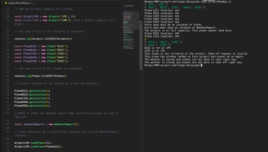

# Airport Challenge

// Please write your own README detailing how to install your project, **how to run the tests**, how you approached the problem and provide screenshots of interacting with your program.

## How to Install and Run the Project

The programme has three classes which you need to create instances of: 

- what classes there are - what the input needs to be for each 

- Can view the total number of planes and airports in existent (that have been created)
- explain how the stormy weather application works 

> Run **node airportRunWay.js** in the terminal to run the project.

## How to Run the Tests

There are 20 tests altogether. 

> Run **node testRunner.js** in the terminal to run the tests.

## How I Approached the Problem 

# Identifying the Nouns and Verbs from the User Stories 


```
                                         _
                 ___                          (_)
               _/XXX\
_             /XXXXXX\_                                    __
X\__    __   /X XXXX XX\                          _       /XX\__      ___
    \__/  \_/__       \ \                       _/X\__   /XX XXX\____/XXX\
  \  ___   \/  \_      \ \               __   _/      \_/  _/  -   __  -  \
 ___/   \__/   \ \__     \\__           /  \_//  _ _ \  \     __  /  \____/
/  __    \  /     \ \_   _//_\___    __/    //           \___/  \/     __/
__/_______\________\__\_/________\__/_/____/_____________/_______\____/____
                                  ___
                                 /L|0\
                                /  |  \
                               /       \
                              /    |    \
                             /           \
                            /  __  | __   \
                           /  __/    \__   \
                          /  /__   |  __\   \
                         /___________________\
                         /          |         \
                              /   _|_   \
                      /      ____/___\____     \
                      ___________[o0o]___________
                               O   O    O
```

# Programme Interaction 

Here are some screenshots of an example programme that was run to show how the console application can work. 

