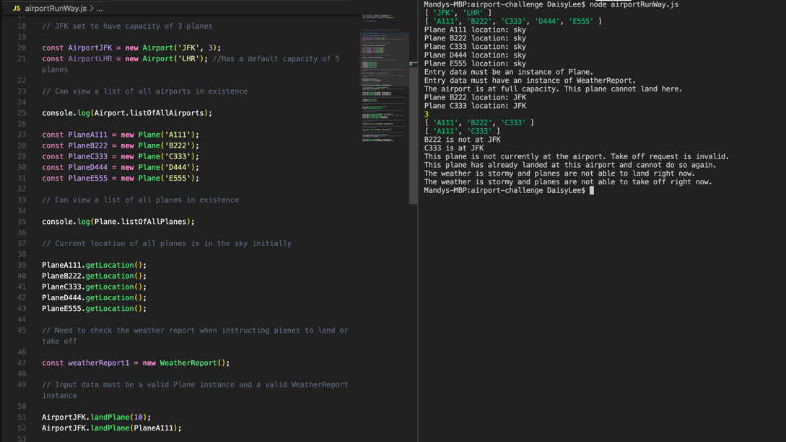
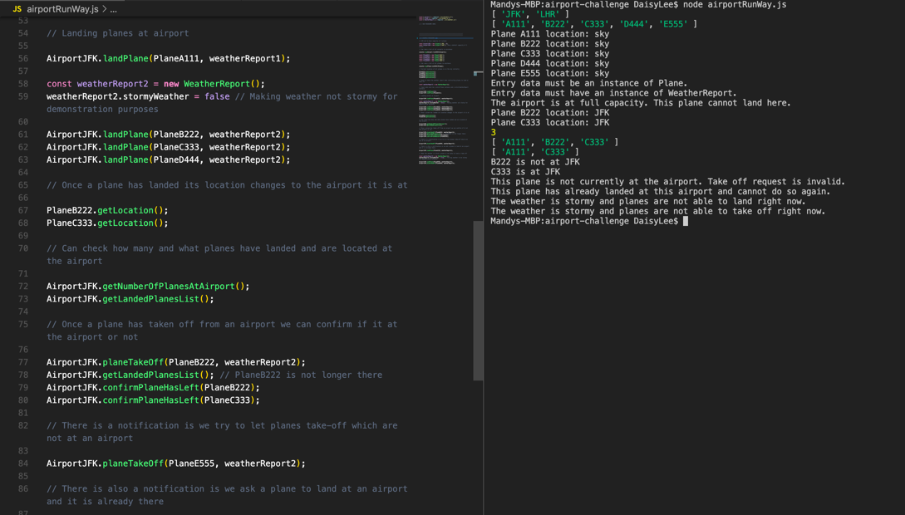
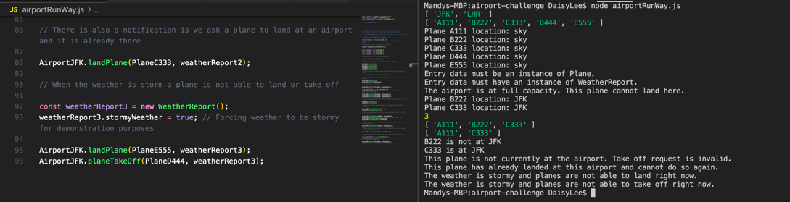

# Airport Challenge

## How to Install and Run the Project

The programme has three classes to create object instances from:

- **Plane**
  
  -  A new Plane is constructed with a name input that has to be three characters long (e.g JFK). 
  -  Newly created planes are located in the sky to begin with and this is updated when they land at an airport. 
  -  To view the location of a plane call the *getLocation()* method. 

- **Airport**
  
  - A new Airport is constructed with a name input and a capacity input. The capacity is defaulted to 5 planes but can be overridden to required specifications.  
  - To view a list of all the landed planes at an airport call the *getLandedPlanesList()* method.
  - To count the number of planes currently at an airport call the *getNumberOfPlanesAtAirport()* method.

- **WeatherReport**
  
  - When a new WeatherReport is constructed it contains the date it was created and reports if the weather is stormy or not. 

### Landing and taking off functionality 

Each airport can request for a specific plane to land and takeoff by calling these methods:

  - *landPlane(plane, weatherReport)*
  - *planeTakeOff(plane, weatherReport)*

  Both require the input of a Plane instance and a WeatherReport instance, especially because the weather can change. 

  To confirm that a plane has taken off from an airport call the *confirmPlaneHasLeft(plane)* method. 

> Run **node airportRunWay.js** in the terminal to run the project.

## How to Run the Tests

There are 20 tests altogether. 

> Run **node testRunner.js** in the terminal to run the tests.

//how you approached the problem and provide screenshots of interacting with your program.

## How I Approached the Problem 

### Identifying the Nouns and Verbs from the User Stories 

| PART | VERB                     | NOUN                                                  |
| ---- | ------------------------ | ----------------------------------------------------- |
| 1    | Air Traffic Controller   | Instruct (to land a plane)                            |
|      | Airport                  |                                                       |
|      | Plane                    |                                                       |
| ---- | --------                 | ------------                                          |
| 2    | Default airport capacity | Overridden as appropriate                             |
| ---- | --------                 | ------------                                          |
| 3    | Airport (full)           | Prevent landing                                       |
| ---- | --------                 | ------------                                          |
| 4    | Airport                  | Instruct (a plane to take off)                        |
|      |                          | Confirm (plane is no longer at the airport)           |
| ---- | --------                 | ------------                                          |
| 5    | Plane (not at airport)   | Prevent asking (the airport to do improbable actions) |
|      | Plane (already landed)   |                                                       |
| ---- | --------                 | ------------                                          |
| 6    | Weather(stormy)          | Prevent take off                                      |
| ---- | --------                 | ------------                                          |
| 7    | Weather(stormy)          | Prevent landing                                       |
| ---- | --------                 | ------------                                          |
| 8    | Planes                   | Count                                                 |

### Domain Modelling 

After extracting the key nouns and verbs form the user stories, I created a domain model to plan out what objects, properties and methods the programme was thought to need to satisfy the user requirements. It helped formulate a structure for the programme which was a strong starting point to build on as development went underway.  

Here is the original domain model:


Originally I wanted to decouple the functionality of requesting a plane to land and take off but in the finalised programme these were embedded within my airport objects since I was confronted with some complications when attempting to decouple it in this way. I would like to work on achieving better encapsulation and cohesion across my objects and overall programme. 

### TDD 

I built my whole programme using the TDD process and found that it allowed the development to be a lot more systematic and structured. I built the project in steps, building upon each consecutive user story one the previous one had been fully tested. This iterative approach meant that the programme was built with a lot more efficiency and direction. 

I used my own testing framework using an assert equals function. 

```
                                         _
                 ___                          (_)
               _/XXX\
_             /XXXXXX\_                                    __
X\__    __   /X XXXX XX\                          _       /XX\__      ___
    \__/  \_/__       \ \                       _/X\__   /XX XXX\____/XXX\
  \  ___   \/  \_      \ \               __   _/      \_/  _/  -   __  -  \
 ___/   \__/   \ \__     \\__           /  \_//  _ _ \  \     __  /  \____/
/  __    \  /     \ \_   _//_\___    __/    //           \___/  \/     __/
__/_______\________\__\_/________\__/_/____/_____________/_______\____/____
                                  ___
                                 /L|0\
                                /  |  \
                               /       \
                              /    |    \
                             /           \
                            /  __  | __   \
                           /  __/    \__   \
                          /  /__   |  __\   \
                         /___________________\
                         /          |         \
                              /   _|_   \
                      /      ____/___\____     \
                      ___________[o0o]___________
                               O   O    O
```

## Programme Interaction 

Here are screenshots from an example programme that was run to show how the console application can work. 



