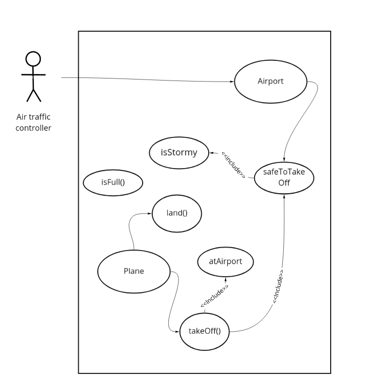

Airport Challenge
=================
# airport-challenge
The first challenge of the Digital Futures Academy, this is my implementation of code to fulfill the given User Stories. Airport related.

## Quick start
```
$ git clone git@github.com:grantwhiteman/airport-challenge.git
npm install
```


## To run tests
```
node specRunner.js
# or
npm test
```

## Method
- Create domain models (table/use case diagram)
- Write a failing test to show expected output
- Write source code to pass the test

## Skills to practise
- Creating domain models to help convert user stories to code
- Test-driven development, test first (using setup/execute/verify)
- Debugging using informative log statements
- Loose coupling/encapsulation

## Reflection

### Went well

- Always wrote tests with the end in mind
- Source code was good, implementing classes and functions in a loosely-coupled way
- Rarely got stuck with code implementation
- Completed extended criteria
- Utilised multiple domain models

### Areas for improvement

- I would have liked to practise more console.logging useful information, reverted a bit to logging 'I'm here' and specific values without context
- tests were definitely too weak, could have been improved to show more definitively that the code had the expected output
- Would have preferred to have more constructors
- Domain models could have been more extensive
- Classes should probably have getters
- I didn't like the implementation of the instructTakeOff and instructLand methods, the if else statements were clumsy and might not even be acceptable

<p>&nbsp;</p>

## Domain models

### User Story 1

```
As an air traffic controller
So I can get passengers to a destination
I want to instruct the airport to land a plane
```
|Object|Properties|Messages|Output| 
|---|---|---|---|
|Airport|   |instructToLandPlane()|land plane @string|

### User Story 2
```
As the system designer
So that the software can be used for many different airports
I would like a default airport capacity that can be overridden as appropriate
```

|Object|Properties|Messages|Output|
|---|---|---|---|
|Airport|capacity @number|defineCapacity()|new capacity @number|

### User Story 3
```
As an air traffic controller
To ensure safety
I want to prevent landing when the airport is full
```

|Object|Properties|Messages|Output|
|---|---|---|---|
|Plane|safeToLand @boolean|land()||

### User Story 4
```
As an air traffic controller
So I can get passengers on the way to their destination
I want to instruct the airport to let a plane take off and confirm that it is no longer in the airport
```

|Object|Properties|Messages|Output|
|---|---|---|---|
|Airport|safeToTakeOff @boolean|takeOff()|takenOff @boolean|

### User Story 5
```
As an air traffic controller
To avoid confusion
I want to prevent asking the airport to let planes take-off which are not at the airport, or land a plane that's already landed
```

|Object|Properties|Messages|Output|
|---|---|---|---|
|Airport|safeToTakeOff @boolean|checkPlaneAtAirport()|takenOff @boolean|


## Extended Acceptance Criteria

### User Story 1 & 2
```
As an air traffic controller
To ensure safety
I want to prevent takeoff when weather is stormy

As an air traffic controller
To ensure safety
I want to prevent landing when weather is stormy
```

|Object|Properties|Messages|Output|
|---|---|---|---|
|Airport||checkWeather()|weather @string|

### User Story 3

```
As an air traffic controller
To count planes easily
Planes that have landed must be at an airport
```
|Object|Properties|Messages|Output|
|---|---|---|---|
|Airport|hangar @array[plane.name@string]|add to hangar (push)|hangar @array including plane|
|Plane|name @string|||

```
UML Use Case Diagram
```


## Example test:
```
global.Math.random = () => 0.4
let plane, airport, expectedOutput, actualOutput

//setup
console.log('instruct airport to take off plane')
airport = new Airport()
plane = new Plane()
expectedOutput = true
//execute
airport.instructTakeOff(plane)
actualOutput = plane.inAir
//verify
console.log(assertEquals(actualOutput, expectedOutput) ? 'Success' : 'Fail')
```
## Output
```
instruct airport to take off plane
Success
```
