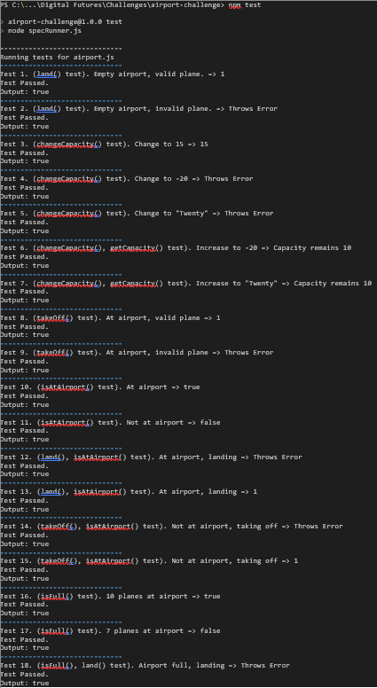
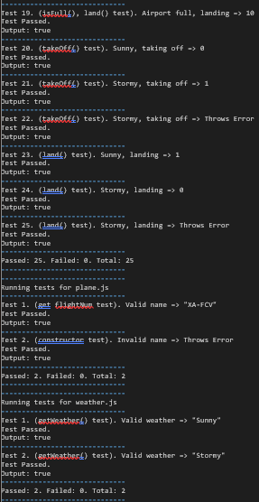

Airport Challenge
=================

```
	   ______
	  __\____\___
=  = ==(____DFA____)
		 \_____\__________________,-~~~~~~~`-.._
		/     o o o o o o o o o o o o o o o o  |\_
		`~-.__       __..----..__      Raj         )
			`---~~\___________/------------````````
		=	=  ===(_________)

```

Installation Steps:
---------

1. Clone the repository to the local machine.
2. Make sure the current working directory in the terminal is './airport-challenge'.
3. Run command 'npm install' to automatically install all project dependecies using the package.json.
4. To run tests the following commands can be used:
    * 'node specRunner.js'
    * 'npm test'

References/Assitance:
--------

* https://api.qunitjs.com/assert/ (Referenced for types of assertion tests)
* VS Code Extention: Mintlify (Helped generated automated documentation for the code)

Workflow details:
--------

* Generated respective domain models for each user story that was provided.
* While (true):
    * Using these I wrote tests for individual messages in the model to test each component.
    * With the failing tests I then wrote pieces of code that passed the respective tests.
* Combined the domain models to remove redundancy and created a final draft for reference when designing the code solution.
* While (true):
    * Wrote extra pieces of tests and complimenting code. Such as some methods that needed to be integrated with the use of other methods.
* Finally, with all passing tests, I refactored the code to have high cohesion and to be loosely-coupled.
* Added final bits of additional documentation to make for cleaner code.

Running Tests Screenshot:
--------




<br>
<br>

#### Acceptance Criteria
---

```
As an air traffic controller
So I can get passengers to a destination
I want to instruct the airport to land a plane
```
| Objects | Properties | Messages | Output |
| ------  | ---------- | -------- | ------ |
| Plane   | flightNum @String | getFlightNum() | @String |
| Airport | planes [@Plane]   | land(@Plane)   | @Void   |
---

```
As the system designer
So that the software can be used for many different airports
I would like a default airport capacity that can be overridden as appropriate
```
| Objects | Properties | Messages | Output |
| ------  | ---------- | -------- | ------ |
| Plane   | - | - | - |
| Airport | planes [@Plane]          | changeCapacity(@Integer) | @Void    |
|         | airportCapacity @Integer | getCapacity()            | @Integer |
---

```
As an air traffic controller
To ensure safety
I want to prevent landing when the airport is full
```
| Objects | Properties | Messages | Output |
| ------  | ---------- | -------- | ------ |
| Plane   | - | - | - |
| Airport | planes [@Plane]          | isFull()      | @Boolean |
|         | airportCapacity @Integer | getCapacity() | @Integer |
---

```
As an air traffic controller
So I can get passengers on the way to their destination
I want to instruct the airport to let a plane take off and confirm that it is no longer in the airport
```
| Objects | Properties | Messages | Output |
| ------  | ---------- | -------- | ------ |
| Plane   | flightNum @String | getFlightNum()      | @String  |
| Airport | planes [@Plane]   | takeoff(@Plane)     | @Void    |
|         | -                 | isAtAirport(@Plane) | @Boolean |
---

```
As an air traffic controller
To avoid confusion
I want to prevent asking the airport to let planes take-off which are not at the airport, or land a plane that's already landed
```
| Objects | Properties | Messages | Output |
| ------  | ---------- | -------- | ------ |
| Plane   | flightNum @String | getFlightNum()      | @String  |
| Airport | planes [@Plane]   | land(@Plane)        | @Void    |
|         | -                 | takeOff(@Plane)     | @Void    |
|         | -                 | isAtAirport(@Plane) | @Boolean |
---
<br>
<br>

### ***Combined Domain Model***
--------------------------
| Objects | Properties | Messages | Output |
| ------  | ---------- | -------- | ------ |
| Plane   | flightNum @String        | getFlightNum()           | @String  |
| Airport | planes [@Plane]          | land(@Plane)             | @Void    |
|         | airportCapacity @Integer | takeOff(@Plane)          | @Void    |
|         | -                        | isAtAirport(@Plane)      | @Boolean |
|         | -                        | isFull()                 | @Boolean |
|         | -                        | changeCapacity(@Integer) | @Void    |
|         | -                        | getCapacity()            | @Integer |
---
<br>
<br>

#### Extended Acceptance Criteria
---

```
As an air traffic controller
To ensure safety
I want to prevent takeoff when weather is stormy
```
| Objects | Properties | Messages | Output |
| ------  | ---------- | -------- | ------ |
| Plane   | flightNum @String | getFlightNum() | @String |
| Weather | weather @String   | getWeather()   | @String |
| Airport | planes [@Plane]   | takeOff(@Plane)| @Void   |
---

```
As an air traffic controller
To ensure safety
I want to prevent landing when weather is stormy
```
| Objects | Properties | Messages | Output |
| ------  | ---------- | -------- | ------ |
| Plane   | flightNum @String | getFlightNum() | @String |
| Weather | status @String    | getWeather()   | @String |
| Airport | planes [@Plane]   | land(@Plane)   | @Void   |
---

```
As an air traffic controller
To count planes easily
Planes that have landed must be at an airport
```
| Objects | Properties | Messages | Output |
| ------  | ---------- | -------- | ------ |
| Plane   | flightNum @String | getFlightNum()      | @String  |
| Airport | planes [@Plane]   | land(@Plane)        | @Void    |
|         | -                 | isAtAirport(@Plane) | @Boolean |
---
<br>
<br>

### ***Combined Domain Model with Extension***
---
| Objects | Properties | Messages | Output |
| ------  | ---------- | -------- | ------ |
| Plane   | flightNum @String | getFlightNum()      | @String  |
| Weather | status @String    | getWeather()        | @String  |
| Airport | planes [@Plane]   | land(@Plane)        | @Void    |
|         | -                 | takeOff(@Plane)     | @Void    |
|         | -                 | isAtAirport(@Plane) | @Boolean |
---