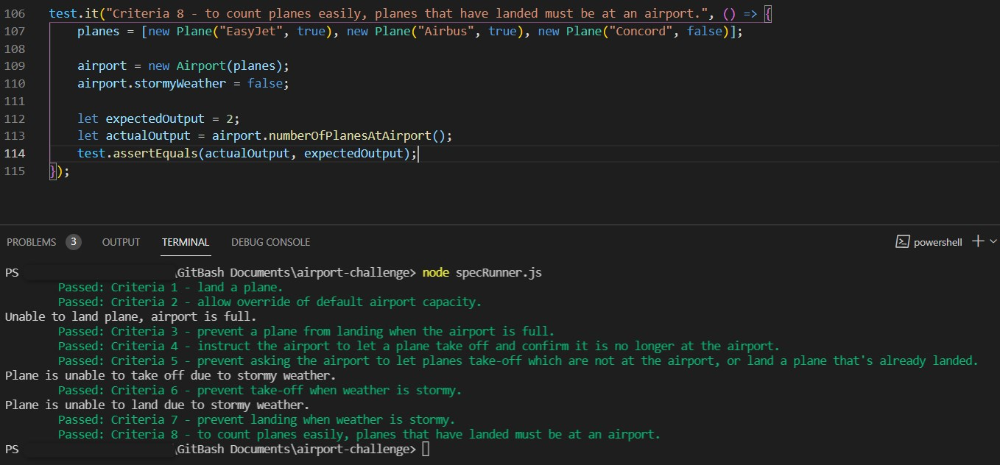

Steps
-------

1. Fork this repo, and clone to your local machine
2. `npm install` to install project dependencies
3. Run the tests using `npm test` or `node specRunner.js`
4. Tests will output in the terminal as green text with "Passed" if they have passed, and red text with "Failed" if there has been a failure, at the start of the outputs.
5. [Lint](https://eslint.org/docs/user-guide/getting-started) your source code using `npx eslint src`

How I approached the problem
-----------------------------

1. First I created some Domain Models from the user stories to plan out the objects and properties I may need for each criteria.
2. In the test-framework file I added a function to use for each test to keep the code clean without much repetition.
3. Any changes made to the project which did not cause any errors, were committed and pushed to GitHub.
4. From the Domain Models, I created some failing tests to fit each criteria.
5. I used `node specRunner.js` in the terminal while the current directory was set to the airport-challenge directory, to check that the tests were failing only due to the module or function not existing yet.
6. After pushing the changes to GitHub again, I started on creating the source code to match each criteria and test, to allow the tests to pass.
7. On creating the tests for the extension criteria tasks, for task 8 I attempted to use a Plane class. For the source code section of this task I spent some time understanding how this other class could be used within the Airport class. I realised that I could call this.planes[0].landed or this.planes[0].name, from the array of planes to retrieve the data needed for certain functions.
8. I spent some time refactoring code from my findings in the above step, where I felt it was needed.
9. I re-ran the tests for each criteria to check if they passed.
10. For any test which was now failing, I amended the source code to fit the use of the new Plane class.

Screenshot of my interaction with the program
-----------------------------------------------

