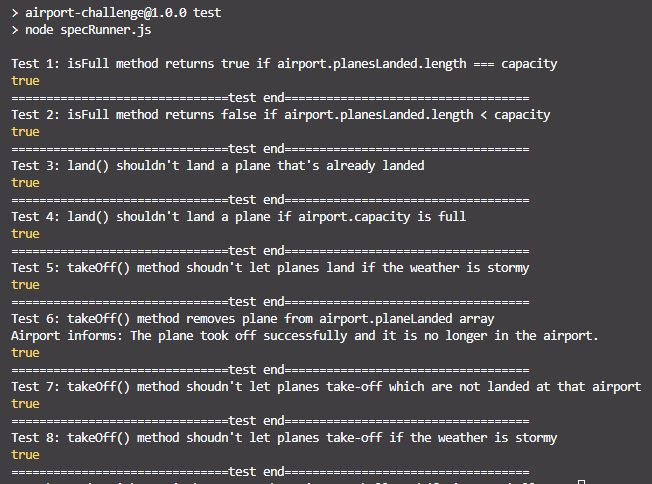
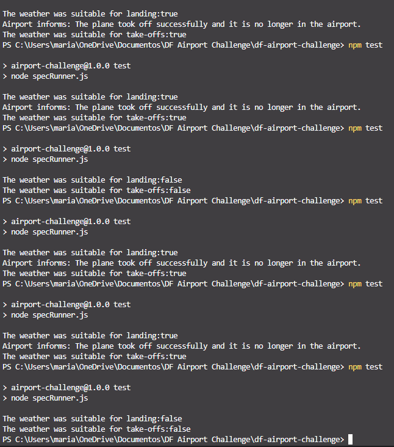

# Airport Challenge

``````
         ______
        __\____\___
=  = ==(____DFA____)
           \_____\__________________,-~~~~~~~`-.._
          /     o o o o o o o o o o o o o o o o  |\_
          `~-.__       __..----..__                  )
                `---~~\___________/------------`````
                =  ===(_________)

``````

## Task

We have a request from a client to write the software to control the flow of planes at an airport. The planes can land and take off provided that the weather is sunny. Occasionally it may be stormy, in which case no planes can land or take off. Here are the user stories that we worked out in collaboration with the client:

## Requirements

```
As an air traffic controller
So I can get passengers to a destination
I want to instruct the airport to land a plane

As the system designer
So that the software can be used for many different airports
I would like a default airport capacity that can be overridden as appropriate

As an air traffic controller
To ensure safety
I want to prevent landing when the airport is full

As an air traffic controller
So I can get passengers on the way to their destination
I want to instruct the airport to let a plane take off and confirm that it is no longer in the airport

As an air traffic controller
To avoid confusion
I want to prevent asking the airport to let planes take-off which are not at the airport, or land a plane that's already landed

As an air traffic controller
To ensure safety
I want to prevent takeoff when weather is stormy

As an air traffic controller
To ensure safety
I want to prevent landing when weather is stormy

As an air traffic controller
To count planes easily
Planes that have landed must be at an airport
```

## Domain Model

| Object  | Properties                 | Message   | Output   |
| ------- | -------------------------- | --------- | -------- |
| Airport | capacity @Int              | isFull()  | @Boolean |
|         | planesLanded @Array[Plane] | land()    | @Boolean |
|         |                            | takeOff() | @Boolean |
| Plane   | id @String                 |           |          |
|         | status @String             |           |          |

## Approach

I started working on the problem by setting up a Domain Model based on the requirements of the User Stories provided. Then I started planning the test that the code should pass to meet those requirements.

Then, following the Test-Driven Development methodology I set a Test Framework and a spec file where I started to work on writings the code for the tests I planned.

When the tests were done I started working on the code for the Airport and Plane objects. After a few bugs and errors that had to be solved before the tests could run properly and some failed tests that led to some modifications in the source code I was able to be sure that my program met all the client requirements.

I decided to work on the extended requirement (the weather feature) after the main ones were done, which resulted in a better implementation overall.

## How to install project

1. Clone this repo to your local machine
2. `npm install` to install project dependencies
3. Run the tests using `npm test` or `node specRunner.js`

## Screenshots



