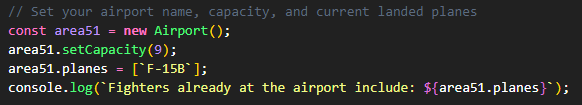
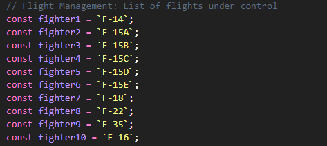
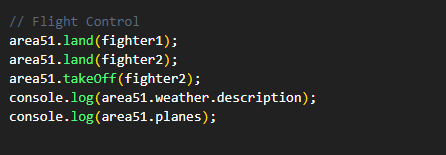
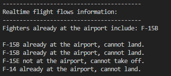
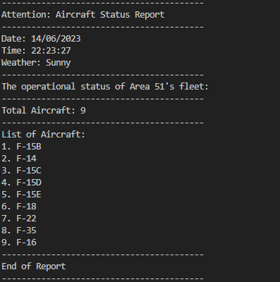

## **Airport Traffic Controller**

```
         ______
        __\____\___
=  = ==(____DFA____)
           \_____\__________________,-~~~~~~~`-.._
          /     o o o o o o o o o o o o o o o o  |\_
          `~-.__       __..----..__                  )
                `---~~\___________/------------`````
                =  ===(_________)

```

Welcome to the **Airport Traffic Controller** App! 😊

## **Introduction**
This wonderful application is designed to efficiently manage and control the flow of flights at airports or fighter aircraft at air bases. Its primary purpose is to ensure smooth and organized operations by providing comprehensive control over the movement and coordination of planes within the designated airspace and under uncertain weather conditions.

### How the App is Created

The development of the Air Traffic Controller application follows a structured approach that incorporates domain modeling and test-driven development (TDD) principles.
* Incorporating specific requirements and user stories into the domain models (see **Table 1**). Through domain modeling, the key objects, relationships, and behaviors of the air traffic control system are defined and implemented. The domain models serve as a blueprint for developing the various components of the application.
* A custom test framework was created to employ the test-driven development. Tests are written before the corresponding code implementation, ensuring that each component of the application is thoroughly tested and meets the expected output.
* All passing tests and associated changes or additions were committed to the codebase to provide evidence-based record of the application's progression.

### Table 1. Domain Models for Airport Challenge

| Object  | Properties    | Message            | Context                           | Output                                 |
| ------- | ------------- | ------------------ | --------------------------------- | -------------------------------------- |
| Airport | planes @Array | land(plane)        | not full                          | @Array[@plane]                         |
|         |               |                    | is full                           | @String “Airport is full, do not land” |
|         |               |                    | plane already landed              | @String “Plane already landed”         |
|         | weather       |                    | weather is stormy                 | @String “Weather is stormy, do not land”|
|         | capacity @int | setCapacity(cap. ) | default capacity and overrideable |                                        |
|         | capacity @int | isFull()           | is full                           | @Boolean TRUE                          |
|         |               |                    | not full                          | @Boolean FALSE                         |
|         | planes @Array | takeOff(plane)     | plane at the airport              | @Array[@plane]                         |
|         |               |                    | plane not at the airport          | @String “Plane not at the airport.”    |
|         | weather       |                    | weather is stormy                 | @String “Weather is stormy, do not takeoff”|
| Weather | description   | description()      | random integer from 1 - 10        | @`Stormy`[1]                           |
|         |               |                    |                                   | @`Sunny` [2 to 10]                     |
| Plane   | name          | getName()          |                                   |                                        |
|         | at airport    | atAirport()        | plane at the airport              | @Boolean TRUE                          |
|         |               | atAirport()        | plane not at the airport          | @Boolean FALSE                         |

Note: The decision was made to forgo the implementation of the Plane class in order to maintain simplicity.

```
# User story 1
As an air traffic controller
So I can get passengers to a destination
I want to instruct the airport to land a plane

# User story 2
As the system designer
So that the software can be used for many different airports
I would like a default airport capacity that can be overridden as appropriate

# User story 3
As an air traffic controller
To ensure safety
I want to prevent landing when the airport is full

# User story 4
As an air traffic controller
So I can get passengers on the way to their destination
I want to instruct the airport to let a plane take off and confirm that it is no longer in the airport

# User story 5
As an air traffic controller
To avoid confusion
I want to prevent asking the airport to let planes take-off which are not at the airport, or land a plane that's already landed

# User story 6
As an air traffic controller
To ensure safety
I want to prevent takeoff when weather is stormy

# User story 7
As an air traffic controller
To ensure safety
I want to prevent landing when weather is stormy

# User story 8
As an air traffic controller
To count planes easily
Planes that have landed must be at an airport
```


## **Getting Started**

### To install and run Airport Traffic Controller App locally, follow these steps:

1. Fork and clone this repository to your local machine:
      ```bash
      git clone https://github.com/coder3114/airport-challenge
2. Navigate to the project directory:
      ```bash
      cd my-airTrafficController-app
3. Install the dependencies using npm:
      ```bash
      npm install
## **Usage**
---------

1. Start the application by running the following command. This command will start the execution of the application using the airTrafficController.js file as the entry point.
      ```bash
      node airTrafficController.js
2. Interact with the application by customizing the following airport and flights features:

* **Airport Status**: The airport status section displays real-time information about the airport, including its name, capacity, weather, and flights currently at the airport.  

  
      

* **Flight Management**: Use the flight management section to view and manage flights. You can add new flights, update flight details, and remove flights from the system.

     

3. Interact with the **Flight Control** section by performing requirements such as adding or updating flights, monitoring airport status, issuing instructions, and communicating with relevant personnel.

      
      

      This APP adhere the following **Airport operation rules**:
```
      1. No plane can land if the airport is at full capacity to ensure available space before allowing any incoming planes to land.
      2. A plane should be at the airport before being granted permission for take-off.
      3. A plane that is already at the airport cannot land again to prevent duplicate landing requests.
      4. No plane can land or take off during stormy weather conditions (10% possibility by default).
      5. Once a plane successfully takes off, it is considered to have left the airport.
      6. Once a plane lands, it must remain at the airport until its next scheduled take-off.
```

4. Utilize the **Reports and Analytics** section to generate reports on flight statistics and analyze airport performance. This helps to provide data-driven decisions and improve airport operations.

      

5. When you're finished using the Airport Traffic Controller app, stop the server by pressing ***`Ctrl + C`*** in the terminal where the app is running.

## **Contributing**
---------

### If you'd like to contribute to Airport Traffic Controller App to make it better, please follow these steps:

1. Fork the repository on GitHub.
2. Create a new branch for your feature:
      ```bash
      git checkout -b feature/your-feature
3. Commit your changes:
      ```bash
      git commit -m "Add your commit message"
4. Push the branch to your forked repository:
      ```bash
      git push origin feature/your-feature
5. Open a pull request on the original repository.

## **Acknowledgments**
---------

Below are the list of resources I find helpful and would like to give credit to:
* [Demos for SE-2306-A June SE Cohort 8](https://github.com/digital-futures-academy/SE-2306-A-Demos)
* [Javascript "Not a Constructor" Exception while creating objects](https://stackoverflow.com/questions/10107198/javascript-not-a-constructor-exception-while-creating-objects)
* [How can I remove a specific item from an array in JavaScript?](https://stackoverflow.com/questions/5767325/how-can-i-remove-a-specific-item-from-an-array-in-javascript)
* [Getting Started with ESLint](https://eslint.org/docs/latest/use/getting-started)
* [README template](https://github.com/coder3114/Best-README.md/tree/master#prerequisites)
* [Writing on GitHub](https://docs.github.com/en/get-started/writing-on-github/getting-started-with-writing-and-formatting-on-github/quickstart-for-writing-on-github)

😊 **Thank you for choosing and utilizing my app! I hope you had a positive experience. If you have any suggestions or questions, please don't hesitate to reach out. I will appreciate your feedback to help improve the app further. I look forward to serving you again in the future.** 😊