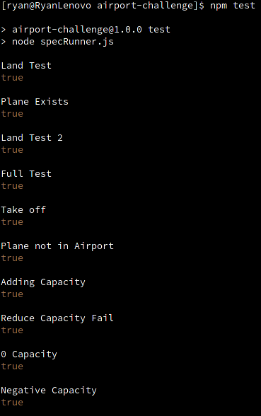

# Airport Challenge

This is my attempt for the airport challenge submission. 

## Installation 
To install, you need to clone the GitHub repository and then run npm install. 

```bash
git clone git@github.com:RyanVanDijck/airport-challenge.git
npm install
```

## Run Tests 
To run the tests, you can use the npm test command or run them directly using the [specRunner.js](specRunner.js) file.

```bash
npm test
npm specRunner.js
```

## My Approach 


### Domain Model
I started the solution by listing the nouns and verbs in the user stories. This allowed me to create a domain model diagram as seen in [this file](domain-model.md). When completing this, I decided that there was no need to create a plane class, as just having an identifying string such as a callsign, would be sufficient to meet the needs of the user. 

### Tests
After I had created the domain model, I wrote tests for the planned airport class in [this file](spec/airport.spec.js). 
This made use a test class written in [another file](spec/test.spec.js). These tests used the properties defined in the domain model to determine the expected behavior of the airport class.

### Airport Class
The final step was to create the [Airport](src/airport.js) class. This was done based on the expected value of the [tests](spec/test.spec.js). 

### Extended Criteria 
To complete the entended criteria, I followed the same method, updating the [domain model](domain-model.md), the [tests](spec/test.spec.js) and the [airport class](spec/airport.spec.js). 

## Screenshots of Tests

### Accepted Tests


### Extended Tests 
 
