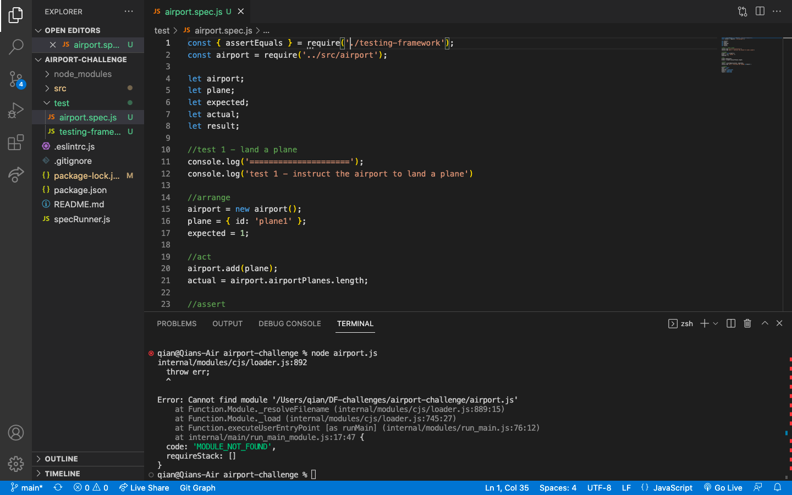
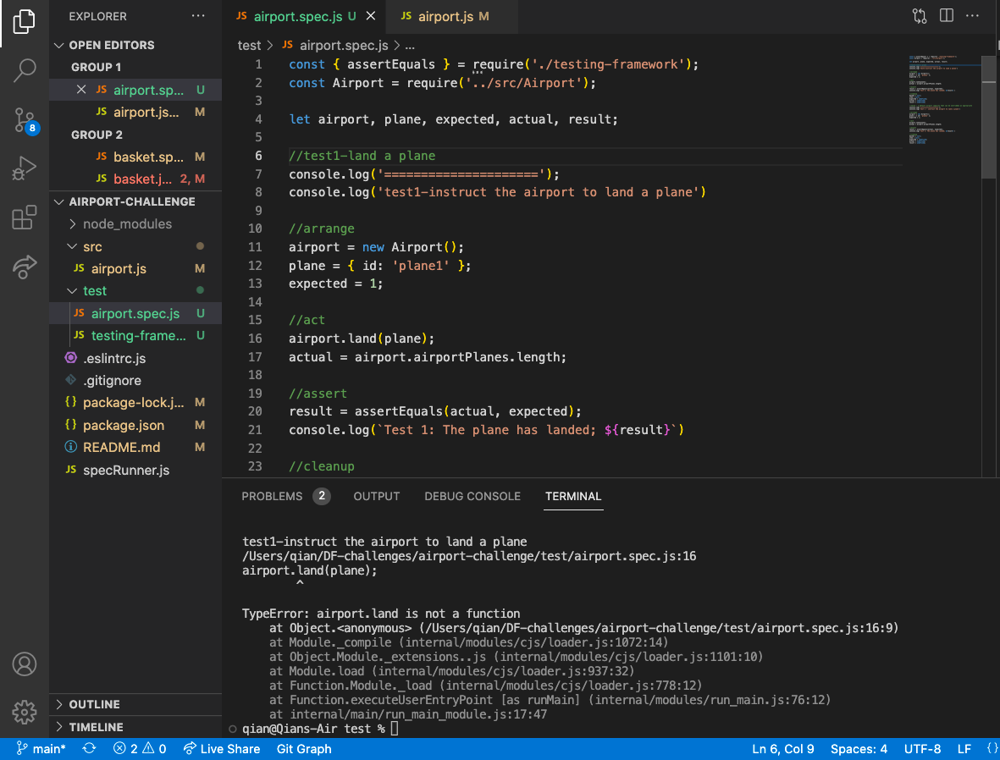
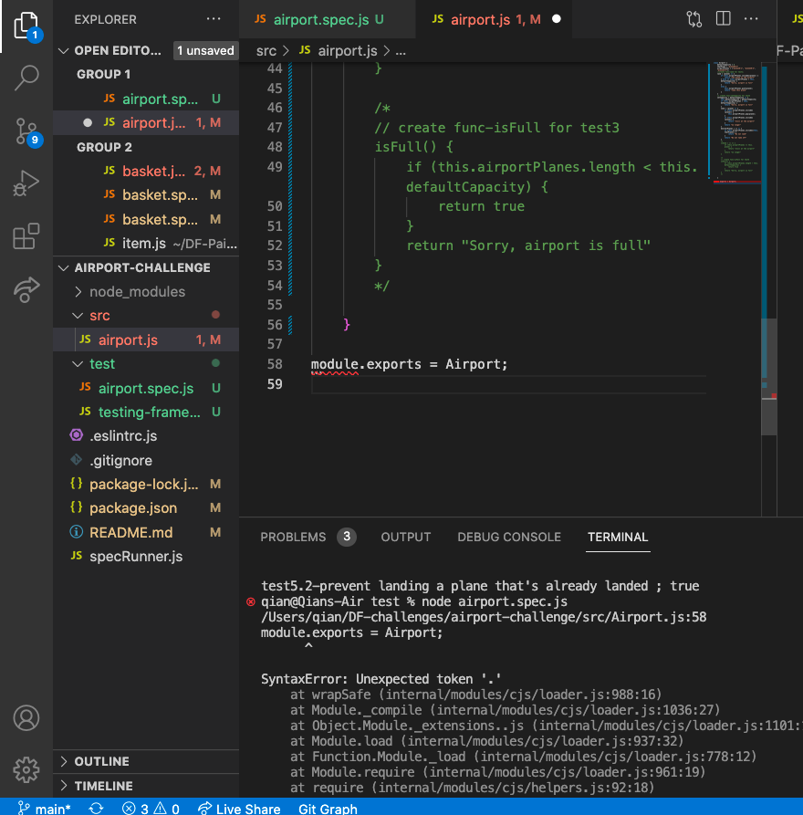
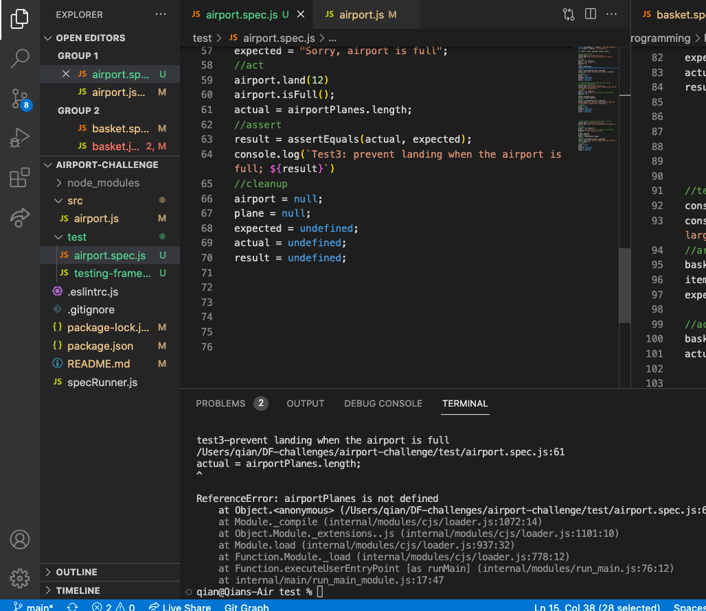
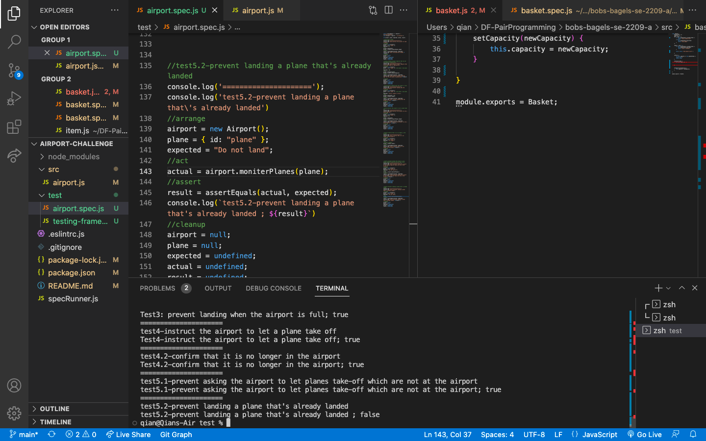
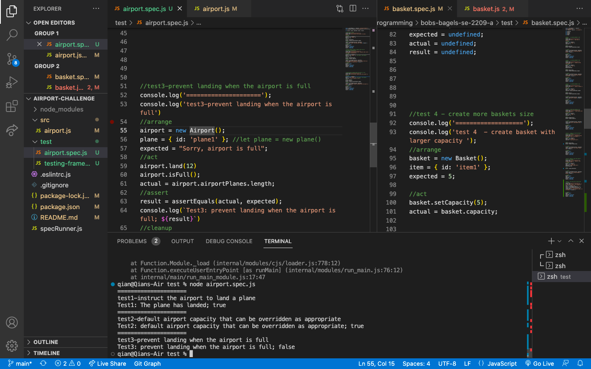

# AIRPORT CHALLENGE

This software is used to control the flow of planes at an airport

## User Stories

```
As an air traffic controller
So I can get passengers to a destination
I want to instruct the airport to land a plane

As the system designer
So that the software can be used for many different airports
I would like a default airport capacity that can be overridden as appropriate

As an air traffic controller
To ensure safety
I want to prevent landing when the airport is full

As an air traffic controller
So I can get passengers on the way to their destination
I want to instruct the airport to let a plane take off and confirm that it is no longer in the airport

As an air traffic controller
To avoid confusion
I want to prevent asking the airport to let planes take-off which are not at the airport, or land a plane that's already landed
```

## Domain Models

### User Story 1

```
As an air traffic controller
So I can get passengers to a destination
I want to instruct the airport to land a plane
```

#### Domain Model

| Objects | Properties                  | Messages     | Output   |
| ------- | --------------------------- | ------------ | -------- |
| Airport | airportPlanes@Array[@plane] | land(@plane) | @Boolean |
|         |                             |              |          |
| Plane   | planeID@Plane               | land()       | @void    |
|         |                             |              |          |

#### Tests
1. Test if a plane is landed at the airport when land is called with plane

---

## User Story 2

```
As the system designer
So that the software can be used for many different airports
I would like a default airport capacity that can be overridden as appropriate
```

#### Domain Model

| Objects | Properties                  | Messages             | Output |
| ------- | --------------------------- | -------------------- | ------ |
| Airport | airportPlanes@Array[@plane] | setCapacity(@number) | @void  |
|         |                             |                      |        |
| Plane   | planeID@Plane               | setCapacity()        | @void  |
|         |                             |                      |        |

#### Tests
1. Test if a default airport capacity can be overridden as appropriate

---

## User Story 3

```
As an air traffic controller
To ensure safety
I want to prevent landing when the airport is full
```

#### Domain Model

| Objects | Properties                  | Messages | Output   |
| ------- | --------------------------- | -------- | -------- |
| Airport | airportPlanes@Array[@plane] | isFull() | @Boolean |
|         |                             |          |          |
| Plane   | planeID@Plane               | isFull() | @Boolean |
|         |                             |          |          |

#### Tests
1. Test if the plane landing is prevented when the airport is full

---

## User Story 4

```
As an air traffic controller
So I can get passengers on the way to their destination
I want to instruct the airport to let a plane take off and confirm that it is no longer in the airport
```

#### Domain Model

| Objects | Properties                  | Messages | Output   |
| ------- | --------------------------- | -------- | -------- |
| Airport | airportPlanes@Array[@plane] | send()   | @Boolean |
|         |                             |          |          |
| Plane   | planeID@Plane               | send()   | @void    |
|         |                             |          |          |

#### Tests
1. Test if the plane is taken off from the airport when send is called
2. Test the confirmation is given when the plane has been taken off

---

## User Story 5

```
As an air traffic controller
To avoid confusion
I want to prevent asking the airport to let planes take-off which are not at the airport, or land a plane that's already landed
```

#### Domain Model

| Objects | Properties                  | Messages | Output   |
| ------- | --------------------------- | -------- | -------- |
| Airport | airportPlanes@Array[@plane] | land()   | @Boolean |
|         |                             | send()   | @Boolean |
|         |                             |          |          |
| Plane   | planeID@Plane               | land()   | @Boolean |
|         |                             | send()   | @Boolean |

#### Tests
1. Test if prevent letting a plane take off when they are not at the airport
2. Test if prevent landing a plane when that's already landed

## Executing program

### Steps
* Install project dependencies by using `npm install` command
* Develop Domain Model by reading User Stories
* Create a test folder containing specification and testing-framework files
* Create a property file containing messages
* Start to run the first test
* Start to run the next tests

### Error
1. 'MODULE_NOT_FOUND'


2. TypeError: airport.land is not a function


3. SyntaxError: Unexpected token '.'


4. ReferenceError: airportPlanes is not defined


5. false test1


6. false test2


## Authors

Qian Zhang

## Acknowledgments
* Thank You Lucas Chagas
* Thank You Chung Yan Ho
